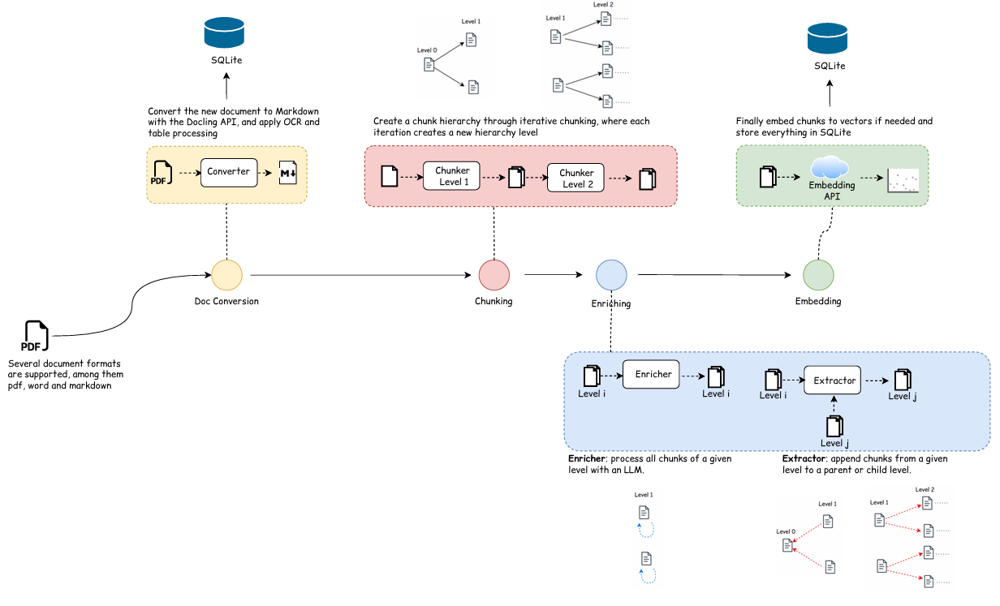

# RAG Pipeline Builder

A no-code interface for designing and executing Retrieval-Augmented Generation (RAG) pipelines over multiple documents. The platform supports multi-document ingestion, document-level orchestration, hierarchical chunking, retrieval over multiple chunk levels, and enrichment workflows that propagate LLM-generated context across the chunk hierarchy.

The system separates document-specific processing from global retrieval and answer generation. Each document can be converted, chunked, enriched, and indexed independently, while the Master pipeline coordinates document selection, chunk reranking, and final response generation across the full document set.

The chunk hierarchy can be structured into multiple levels, such as Chapter and Section, and enrichment methods can attach generated summaries or context to parent and child nodes. Pipeline configurations can be saved and reused, allowing complex document processing workflows to be applied consistently across many documents.

In this walkthrough, I submit a query and the interface streams live feedback about the documents and chunks being scanned and retrieved. When the answer arrives, I navigate to the Dashboard and Graph tabs to inspect the evidence sources and the hierarchical chunk structure retrieved from each document.

<video controls width="100%" preload="metadata">
  <source src="https://raw.githubusercontent.com/PabloJM21/RAG_app/main/Screen%20casts/chat_screencast.mp4" type="video/mp4">
  Your browser does not support the video tag.
</video>


## System Overview

The platform is organized around two complementary layers:

- **Master Pipeline / Orchestration Layer**: the Master pipeline is the orchestration layer of the project. It coordinates all document pipelines, filters the most relevant documents, and prepares the final context for answer generation.
- **Document Pipelines**: each uploaded document is processed independently through conversion, chunking, enrichment, and retrieval.

This architecture makes it possible to process multiple documents efficiently while keeping each pipeline customizable and reusable.


## Master Pipeline

The Master pipeline operates across all processed documents rather than inside a single document. It brings together evidence from multiple document pipelines before producing the final answer.

### Router

The Router performs document-level filtering. Instead of consulting every uploaded document, it identifies which documents are likely relevant to the current question. This reduces unnecessary retrieval work and improves efficiency.

### Reranker

The Reranker is applied after the relevant chunks are retrieved from the selected document pipelines. It evaluates the retrieved chunks collectively and ranks them according to relevance before the final context is passed to the generator.

### Generator

The Generator produces the final answer using the filtered and reranked evidence. By the time this stage is reached, the system has already assembled the most relevant content needed to answer the user’s query.

---

## Document Pipelines

Each uploaded document has its own independent processing pipeline. These pipelines transform raw documents into structured, searchable chunks that can later be used by the Master pipeline during answer generation.

### Backend Architecture

<p align="center">
  
</p>

The backend is composed of three main layers:

- **Agents**: chat assistant APIs, document conversion, and OCR processing
- **Data Processing**: ingestion, markdown conversion, chunk generation, enrichment, and retrieval
- **Data Storage**: SQLite-based storage for chunks, embeddings, and metadata

A document pipeline is composed of four main stages:

1. **Document Conversion**
2. **Chunking**
3. **Enrichment**
4. **Retrieval**

Each stage can be configured with multiple methods, making it possible to build highly tailored workflows for different document types and retrieval strategies.

### Build a document pipeline

This screencast shows the full workflow from document conversion to retrieval. The chunking pipeline creates two hierarchy levels, called "Chapter" and "Section". In enrichment, I create a document summary that is used by the Master Router for document filtering, and I also attach context sections to each Section chunk by summarizing the corresponding Chapter. These Chapter summaries are then propagated upward to the document level to build the overall document summary. The retrieval stage uses two Reasoner retrievers: first at the Chapter level and then at the Section level for the filtered Chapters.

<video controls width="100%" preload="metadata">
  <source src="./Screen%20casts/doc_pipeline_sceencast.mp4" type="video/mp4">
  Your browser does not support the video tag.
</video>

---

## 1. Document Conversion

Document conversion is the first stage of every document pipeline. Uploaded files are transformed into a normalized Markdown representation using a backend built around Docling. This unified format simplifies all downstream steps and supports consistent processing across document types.

Supported inputs include PDFs, Word documents, and other formats supported by Docling. OCR support is available for scanned or image-based documents, allowing the system to extract content from non-standard sources.

---

## 2. Chunking

The chunking stage creates a hierarchy of text segments from the converted document. Users can compose multiple chunking methods in sequence, where the output of one chunker becomes the input to the next. This enables recursive and hierarchical document representations that preserve structure and improve retrieval quality.

### Supported chunking strategies

#### Paragraph Chunker

The Paragraph Chunker splits content using configurable separators, which makes it especially useful for preserving document structure such as headings or sections. When the maximum word count is left empty, each separator begins a new chunk.

#### Sliding Window Chunker

The Sliding Window Chunker creates overlapping segments using a configurable window size. The overlap parameter preserves continuity across adjacent chunks and helps maintain context at chunk boundaries.

---

## 3. Enrichment

The enrichment stage improves the semantics of the generated chunks by adding contextual information and reducing noise. Rather than changing the original document directly, enrichment methods operate on the chunk hierarchy produced during chunking.

Typical operations include:

- Context sharing between hierarchy levels
- Content rewriting
- Prompt-based transformations
- Filtering
- Restoring chunks to their original state

These steps are fully configurable through editable prompts and can be adapted to a wide range of retrieval goals.

### Extractor

The Extractor transfers titles or content between hierarchy levels. For example, chapter titles can be propagated upward to document-level nodes, or parent context can be attached to child chunks. This creates richer semantic structures and improves downstream retrieval quality.

### Enricher

The Enricher uses an LLM to transform or augment chunk content through customizable prompts. It can be used for summarization, keyword extraction, metadata generation, rewriting, or domain-specific annotation.

### Filter and Reseter

The Filter removes chunks that should not participate in later stages, such as empty or irrelevant content. The Reseter restores chunks to their original state after temporary transformations, which is useful when contextual enrichment should not permanently overwrite the underlying text.

### Enrich and inspect results

This walkthrough highlights how a user can enrich chunks and immediately review the results. It also shows how the completed document pipeline can be exported into another document, making it easy to save and reuse complex workflows across many documents.

<video controls width="100%" preload="metadata">
  <source src="./Screen%20casts/enrichment_screencast.mp4" type="video/mp4">
  Your browser does not support the video tag.
</video>

---

## 4. Retrieval

The retrieval stage prepares chunks for semantic search and later use by the Master pipeline. Different retrievers can be chained together so that each stage filters or narrows the candidate set before the next step is applied.

This allows the system to build hierarchical retrieval strategies in which, for example, a first retriever finds the most relevant chapters and a second retriever narrows the search to the best sections within them.

### Common retrieval configuration

#### Retrieval amount

This parameter defines the maximum number of chunks returned by a retriever. It is available for most retrievers, except for the Reasoner Retriever, which can dynamically determine the number of relevant chunks.

#### Query pre-processing

Before retrieval, the user query can optionally be transformed using an LLM. This helps rewrite ambiguous questions, expand them with additional context, or adapt them for specific retrieval strategies.

### Embedding Retriever

The Embedding Retriever performs semantic retrieval using dense vector embeddings. Each chunk and query is encoded into a shared embedding space, and retrieval is performed by comparing their similarity. The system currently supports several embedding models with different trade-offs in performance, multilingual support, and computational cost.

### Reasoner Retriever

The Reasoner Retriever delegates chunk selection to a Large Language Model. Instead of relying entirely on vector similarity, it evaluates the candidate chunks and determines which ones are most relevant to the current query.

---

## Pipeline Actions

Certain stages require explicit execution before the processed data becomes available for retrieval.

### Run actions

Each document pipeline can be executed independently. The available actions include:

- Convert document
- Run chunking
- Execute enrichment
- Stage retrieval

The Stage Retrieval action prepares the retrieval pipeline for querying. For embedding-based retrievers, this step computes and stores the vector embeddings in the database.

The Master pipeline also offers global actions so that conversion, chunking, and retrieval staging can be executed for all documents that have not yet been processed. This simplifies large-scale batch processing.

### Save, load, and export

Pipeline configurations can be saved for future reuse. Users can also export the configuration of a document under a custom name and later import it into other documents, enabling reusable pipeline presets for recurring workflows.


# User Interface

The application provides an intuitive no-code interface for designing RAG pipelines.

Users can:

* Upload multiple documents
* Edit each document's processing pipeline
* Configure the global Master Pipeline
* Save and reuse pipeline presets
* Customize the interface theme
* Assign custom colors to pipeline methods for improved visualization

The left panel displays all uploaded documents, while selecting a document opens its configurable processing pipeline.

---

# Deployment

For deployment architecture, CI/CD, and Azure infrastructure, see:

```
docs/deployment.md
```

---

# Setup

## Installing Required Tools

### 1. uv

The backend uses **uv** for dependency management.

Installation instructions:

https://docs.astral.sh/uv/getting-started/installation/

### 2. Node.js, npm and pnpm

Install Node.js and npm:

https://nodejs.org/en/download/

Then install pnpm:

```bash
npm install -g pnpm
```

---

# Build the Project

## Backend

```bash
cd fastapi_backend
uv sync
```

## Frontend

```bash
cd nextjs-frontend
pnpm install
```

---

# Running the Application

Start the backend:

```bash
make start-backend
```

Start the frontend:

```bash
make start-frontend
```
