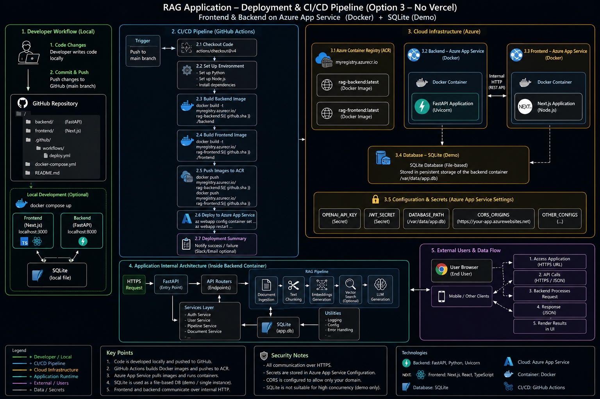

## Try RAGain

<p align="center">
    <em>Create, manage, and interact with RAG pipelines across multiple document formats.</em>
</p>

---

Tool designed to create and interact with Retrieval-Augmented Generation (RAG) pipelines that are highly scalable and customizable. It enables users to upload and work with multiple documents—such as PDFs, Word files, and other formats and seamlessly query them through a unified interface. 

- Agents: APIs for Chat Assistants, Document conversion and image processing through OCR
- Data processing: Document ingestion, tect chunking and merging via an end-to-end unstructured data pipeline (ETL) 
- Data storage: SQLite database for storing text chunks and vectorized text embeddings 


---

## Technology stack


* Frontend - Vercel
* Backend - Azure App Service
* Database - SQLite
* CI/CD - GitHub Actions

---
## Architecture
<div style="position: relative;">

<!-- Background Image -->

<p align="center">
  
</p>

<!-- Foreground Content -->

<div style="position: relative; z-index: 1; padding: 20px;">


## Chunking

---

## Setup

### Installing Required Tools

#### 1. uv

`uv` is used to manage Python dependencies in the backend. Install it by following the official guide:
https://docs.astral.sh/uv/getting-started/installation/

#### 2. Node.js, npm, and pnpm

To run the frontend, ensure Node.js and npm are installed:
https://nodejs.org/en/download/

After that, install pnpm globally:

```bash
npm install -g pnpm
```

---

## Build the Project

To set up the project locally:

### Backend

Navigate to the `fastapi_backend` directory and run:

```bash
uv sync
```

### Frontend

Navigate to the `nextjs-frontend` directory and run:

```bash
pnpm install
```

---

## Running the Application

Start the FastAPI server:

```bash
make start-backend
```

Start the Next.js development server:

```bash
make start-frontend
```

</div>
</div>
